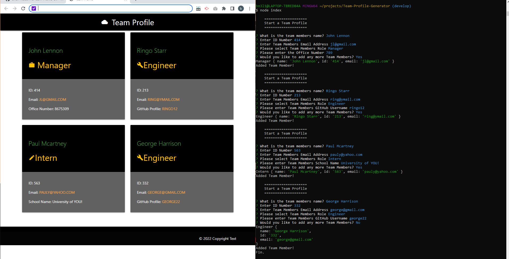
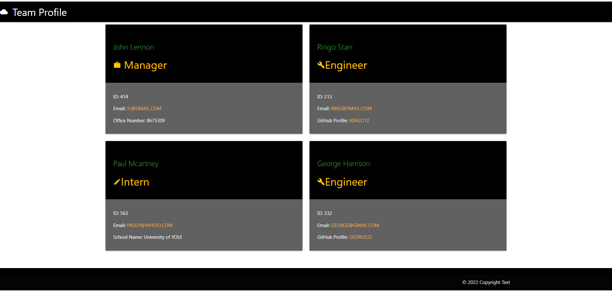

# Team-Profile-Generator 🚀

## Table of Contents
* [Description](#description)
* [Installation](#installation)
* [Usage](#usage)
* [Contribution](#contribution)
* [Tests](#tests)
* [Contact](#contact-me)

# Description

This project was created to generate a fast, efficient and professional Team Profile straight from the command line. Using the inquirer module from node.js, we prompt user for data on employees on their team. Once finished you will have a custom html page with 'cards' for each employee. This project also uses the Jest module for testing each object or TDD, found in the tests folder. 

# Installation

Prerequisites: [Node.js](https://nodejs.org/en/) &amp; [Inquirer](https://www.npmjs.com/package/inquirer) &amp; [Jest](https://www.npmjs.com/package/jest)

* Clone code to your own local repo following the link below. 
* Using Command Line, head over to the root directory.
* run npm install
* Install Jest and Inquirer using links above.
* Change value following "test" to jest. Located under scripts in package.json file.
* run node index!
**See Usage for Tutorial!**

**[Install Link](https://github.com/brian-nelson10/Team-Profile-Generator.git)**

# Usage

Run 'node index' from the command line. You will then be prompted to answer questions about your team.
Your HTML file will be generated in the 'dist' folder called team-profile.html. 
See video tutorial below!

**[Video Tutorial]()**

**Screenshots!**

 

# Contribution

Currently seeking those who can provide eyeball time, brain juice, lines of code, code improvements, raising an issue, asking a question, run the communication outside of the code repo, or even stump up some coin! Please see contact for link!! 

# Tests

Install Jest 
Run npm test in root directory to run test on constructor functions. 

# Contact Me 

Want to contribute?? Drop me a line **[here](mailto:bn3l10@gmail.com)**

Check out my **[GitHub](https://github.com/brian-nelson10)**

## Maker
Made with ❤️ by brian

